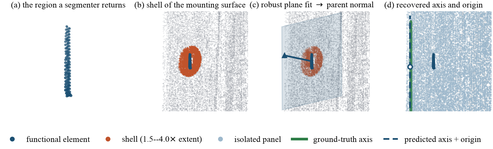

# mountpoint

Training-free articulation estimation for functional elements in 3D scans.



A functional element — a handle, a knob, a switch — carries almost no
information about how it moves. The surface it is **mounted on** carries all of
it. `mountpoint` fits a plane to a shell of neighbourhood points around the
element, deliberately excluding the element's own points, and reads the motion
type, axis and origin off that surface together with the scan's gravity axis.

No training, no per-scene optimisation, no constant fitted to a reported score.

```python
from mountpoint import predict_motion

p = predict_motion('hook_pull', element_points, neighbourhood_points)
p['motion_type']    # 'rot' | 'trans'
p['motion_dir']     # unit axis
p['motion_origin']  # a point on the axis; None for translations
```

## Install

```bash
git clone https://github.com/Ahan12/mountpoint && cd mountpoint
python3 -m venv .venv && .venv/bin/pip install -r requirements.txt
.venv/bin/python tests/test_smoke.py          # must print OK
```

The motion module needs only numpy. The 2D front end that produces regions is
optional and needs a GPU: `pip install -r requirements-pipeline.txt`.

Run the smoke test before anything else. It builds a synthetic door from
geometry alone and asserts the hinge comes out vertical and on the far edge from
the handle, so a bad install is distinguishable from a real result.

## Data

Datasets come from their own authors under their own licences and are not
redistributed here. Point the package at yours:

```bash
export MOUNTPOINT_DATA=/path/to/scenefun3d        # required
export SCENEFUN3D_TOOLKIT=/path/to/scenefun3d     # segmentation metrics only
export ARTICULATE3D_DATA=/path/to/validation      # cross-dataset transfer only
```

`$MOUNTPOINT_DATA` is expected to look like this. `data/` and `frames/` come
from SceneFun3D; the rest is built by the two `build_*` scripts.

```
data/<visit>/<visit>_laser_scan.ply, _annotations.json, _motions.json
frames/                posed RGB-D — 2D front end only
cache/<visit>.npz      per-element points and neighbourhoods
origins/<visit>.npz    ground-truth axis origins
exemplar_db.pkl        retrieval gallery
```

```bash
python scripts/build_cache.py --radius 1.10 --cap 120000
python scripts/build_exemplar_db.py
```

The 1.10 m neighbourhood radius is not arbitrary — at 0.60 m, 37% of true hinge
origins fall outside the neighbourhood entirely.

## Running

```bash
python scripts/eval_motion.py            # motion parameters, SceneFun3D
python scripts/eval_composed.py          # SceneFun3D composed motion metric
python scripts/eval_segmentation.py      # detection AP / AR
python scripts/eval_articulate3d.py      # cross-dataset transfer
```

`eval_motion.py` is the one to start with: it reports the per-class table, the
overall gate with scene-clustered bootstrap intervals, and signed direction
accuracy. Pass `--bootstrap 0` to skip the intervals and run about ten times
faster.

## Layout

| | |
|---|---|
| `mountpoint/` | the package |
| `mountpoint/motion.py` | **the method** — parent surface, axis, origin, sign |
| `mountpoint/pipeline.py` | 2D localisation: retrieval → box → correspondence → mask |
| `mountpoint/lifting.py` | 2D masks to raw-scan points, depth-checked |
| `mountpoint/retrieval.py` | CLIP exemplar retrieval |
| `mountpoint/metrics.py` | evaluation against the official protocols |
| `mountpoint/config.py` | every path and every tunable, in one file |
| `scripts/` | entry points — two to build caches, four to evaluate |
| `assets/` | figures |
| `tests/` | synthetic smoke test, no data needed |

Paths resolve from the environment rather than from a config file on disk, so
there is exactly one copy of the package and one data root, both nameable.

## Models

The front end composes four frozen models, fetched once into
`$MOUNTPOINT_DATA`:

| model | role | source |
|---|---|---|
| CLIP ViT-L/14 | exemplar retrieval | `open_clip`, automatic |
| GroundingDINO-tiny | box proposals | Hugging Face, automatic |
| SAM ViT-B | masks | Meta's Segment Anything release |
| DINOv3 ViT-L/16 | dense correspondence | Hugging Face — request access, then place the checkpoint at `$MOUNTPOINT_DATA/dinov3_vitl16.pth` |

## Citation

Paper under submission; BibTeX will follow.

## License

MIT — see [LICENSE](LICENSE).
